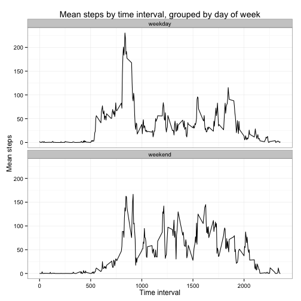

## Loading and preprocessing the data
The following code loads the data file (activity.csv) and saves it to the variable `movement`. Then, it loads the `dplyr`, `ggplot2`, and `lubridate` packages.

```r
setwd("/Users/earlbrown/coursera/reprod/RepData_PeerAssessment1")
movement <- read.table("activity.csv", sep = ",", header = T)
suppressPackageStartupMessages(library("dplyr"))
library("ggplot2")
library("lubridate")
```


## What is mean total number of steps taken per day?
The table below the following code displays the mean number of steps taken in each of the 61 days in the data file.

```r
steps_by_day <- movement %>% group_by(date) %>% summarise(num_steps = sum(steps, na.rm = T))
print(as.data.frame(steps_by_day))
```

```
##          date num_steps
## 1  2012-10-01         0
## 2  2012-10-02       126
## 3  2012-10-03     11352
## 4  2012-10-04     12116
## 5  2012-10-05     13294
## 6  2012-10-06     15420
## 7  2012-10-07     11015
## 8  2012-10-08         0
## 9  2012-10-09     12811
## 10 2012-10-10      9900
## 11 2012-10-11     10304
## 12 2012-10-12     17382
## 13 2012-10-13     12426
## 14 2012-10-14     15098
## 15 2012-10-15     10139
## 16 2012-10-16     15084
## 17 2012-10-17     13452
## 18 2012-10-18     10056
## 19 2012-10-19     11829
## 20 2012-10-20     10395
## 21 2012-10-21      8821
## 22 2012-10-22     13460
## 23 2012-10-23      8918
## 24 2012-10-24      8355
## 25 2012-10-25      2492
## 26 2012-10-26      6778
## 27 2012-10-27     10119
## 28 2012-10-28     11458
## 29 2012-10-29      5018
## 30 2012-10-30      9819
## 31 2012-10-31     15414
## 32 2012-11-01         0
## 33 2012-11-02     10600
## 34 2012-11-03     10571
## 35 2012-11-04         0
## 36 2012-11-05     10439
## 37 2012-11-06      8334
## 38 2012-11-07     12883
## 39 2012-11-08      3219
## 40 2012-11-09         0
## 41 2012-11-10         0
## 42 2012-11-11     12608
## 43 2012-11-12     10765
## 44 2012-11-13      7336
## 45 2012-11-14         0
## 46 2012-11-15        41
## 47 2012-11-16      5441
## 48 2012-11-17     14339
## 49 2012-11-18     15110
## 50 2012-11-19      8841
## 51 2012-11-20      4472
## 52 2012-11-21     12787
## 53 2012-11-22     20427
## 54 2012-11-23     21194
## 55 2012-11-24     14478
## 56 2012-11-25     11834
## 57 2012-11-26     11162
## 58 2012-11-27     13646
## 59 2012-11-28     10183
## 60 2012-11-29      7047
## 61 2012-11-30         0
```

### Histogram of number of steps per day
This histogram displays the number of unique days with the corresponding number of steps taken.

```r
plot1 <- steps_by_day %>% ggplot(aes(num_steps)) + geom_histogram() + labs(title = "Histogram of steps in a day", x = "Number of steps") + theme_bw()
suppressMessages(print(plot1))
```

 

### Mean and median number of steps
The following code produces the mean and median number of steps taken across all days.

```r
movement %>% summarise(mean_steps = mean(steps, na.rm = T), median_steps = median(steps, na.rm = T)) %>% print()
```

```
##   mean_steps median_steps
## 1    37.3826            0
```


## What is the average daily activity pattern?
The following line plot displays the number of steps by time interval during the day.

```r
mean_steps_by_interval <- movement %>% group_by(interval) %>% summarise(mean_steps = mean(steps, na.rm = T))
plot2 <- mean_steps_by_interval %>% ggplot(aes(interval, mean_steps)) + geom_line() + theme_bw() + ggtitle("Mean steps by time interval") + xlab("Time interval") + ylab("Mean steps")
print(plot2)
```

 

### Time interval during day with most steps
The following displays the 5-minute time interval during the day with the largest number of steps.

```r
mean_steps_by_interval %>% filter(mean_steps == max(mean_steps))
```

```
## Source: local data frame [1 x 2]
## 
##   interval mean_steps
## 1      835   206.1698
```


## Imputing missing values

### Number of NAs
The following displays the number of rows with a missing value for the `steps` variable.

```r
movement %>% filter(is.na(steps)) %>% nrow()
```

```
## [1] 2304
```

### Filling in NAs
The following code calculates the mean number of steps by 5-minute time interval during the day and then replaces the missing values with their corresponding mean number of steps, and then creates a new data frame labeled `movement2`.

```r
mean_by_interval <- movement %>% group_by(interval) %>% summarise(mean_steps = mean(steps, na.rm = T))
movement2 <- movement %>% left_join(mean_by_interval) %>% mutate(steps = ifelse(is.na(steps), mean_steps, steps)) %>% select(steps, date, interval)
```

```
## Joining by: "interval"
```

### Histogram of number of steps per day, with missing values filled in

```r
steps_by_day2 <- movement2 %>% group_by(date) %>% summarise(num_steps = sum(steps))
plot <- steps_by_day2 %>% ggplot(aes(num_steps)) + geom_histogram() + labs(title = "Histogram of steps in a day, with NAs filled in", x = "Number of steps") + theme_bw()
print(plot)
```

```
## stat_bin: binwidth defaulted to range/30. Use 'binwidth = x' to adjust this.
```

 

### Updated mean and median number of steps, with missing values filled in
The following calculates the mean and median number of steps, with the missing values filled in. These values not differ from the original values, showing that imputing missing values with the mean for the time interval does not change the estimates.

```r
movement2 %>% summarise(mean_steps = mean(steps), median_steps = median(steps)) %>% print()
```

```
##   mean_steps median_steps
## 1    37.3826            0
```


## Are there differences in activity patterns between weekdays and weekends?
This code creates a new variable to code weekdays versus weekends.

```r
movement2 <- movement2 %>% mutate(day_of_week = ifelse(wday(ymd(date)) %in% c(1, 7), "weekend", "weekday"))
```

The following plot displays the mean number of steps by 5-minute time interval during the day, grouped by day of the week

```r
mean_steps_by_interval <- movement2 %>% group_by(interval, day_of_week) %>% summarise(mean_steps = mean(steps, na.rm = F))
plot <- mean_steps_by_interval %>% ggplot(aes(interval, mean_steps)) + geom_line() + theme_bw() + ggtitle("Mean steps by time interval, grouped by day of week") + xlab("Time interval") + ylab("Mean steps") + facet_wrap(~ day_of_week, nrow = 2)
print(plot)
```

 
